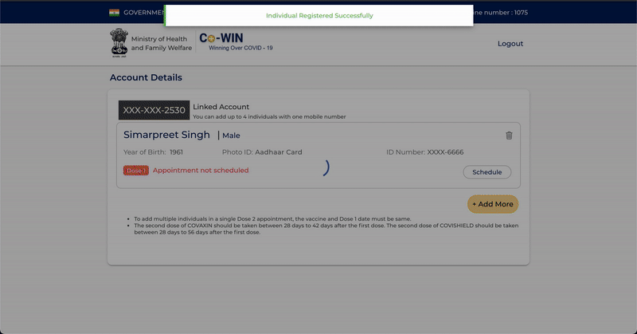
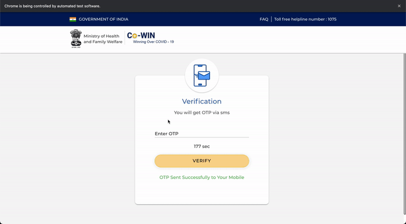
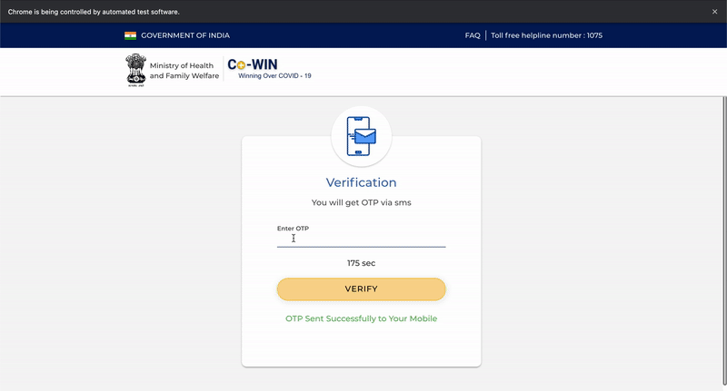

# cowin-scheduler

cowin-scheduler is a `command line utility tool` that allows to automate registering a user on Cowin Portal, schedule/cancel appointments for Covid vaccination and delete user details from the portal as well.

## Features

* **Schedule an appointment** - Logins to the cowin portal, registers the user, schedules an appointment and sends a confirmation mail having the appointment details to the user's email address.


* **Cancel an appointment** - Logins to the cowin portal, cancels the appointment and sends a confirmation mail about the cancellation to the user's email address.


* **Delete User Details** - Logins to the cowin portal, deletes the registered user from the portal and sends a confirmation mail about the user details deletion to the user's email address.


**NOTE**: The login is based on OTP based verification. During the script execution, user has to input the OTP received on his/her phone. The script will wait for 3 minutes(same as the portal) for this input.

## Prerequisites

Before you begin, ensure you have met the following requirements:
* You have `node.js` installed

## Tech Stack

* Node.js
* Javascript
* Puppeteer
* Nodemailer

## Setup

* To install, follow these steps:

```
npm install or npm i
```

## Using cowin-scheduler

User has to create a json file in the `utils/userDetails.json` path. The JSON file shall have the following format - 

```
{
    "userDetails": {
        "phone": "xxxxxxxxxx", 
        "photoId": "AadhaarCard/DrivingLicense/PANCard/Passport/PensionPassbook/NPRSmartCard/VoterIDCard", --> Choose any one in the same format
        "photoIdNumber": "xxxxxxxxxxxx",  --> Valid ID number
        "name": "your name",
        "gender": "Male/Female/Others",
        "birthYear": "YYYY", --> User must be greater than 45 years old in order to schedule an appointment on cowin portal as of now
        "pinCode": "xxxxxx",
        "email": "your email address"
    }
}
```

Following commands can be used:

* Schedule an Appointment
```
node index.js scheduleAppointment
```

* Cancel an Appointment
```
node index.js cancelAppointment
```

* Delete User Details from Cowin Portal
```
node index.js deleteUserDetails
```

* Help - to list out all the available commands
```
node index.js help
```

## NOTE

This project was created as part of a hackathon over a weekend.
